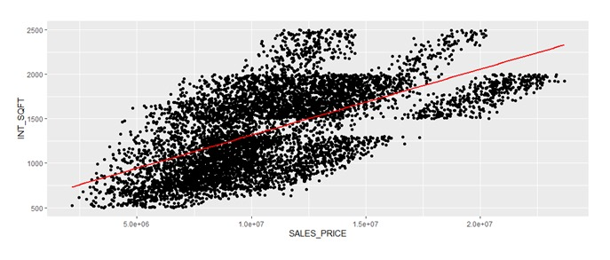
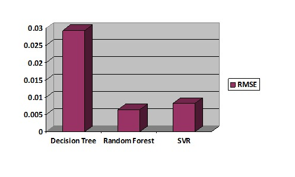
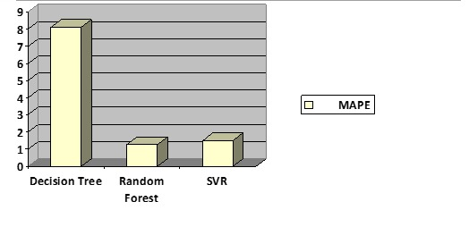
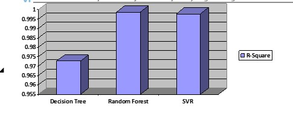

# Housing Price Prediction in Chennai City

## Table of Contents
1. [Overview](#overview)
2. [Dataset](#dataset)
3. [Objective](#objective)
4. [Project Description](#project-description)
5. [Implementation](#implementation)
6. [Results](#Results)
7. [Conclusion](#conclusion)


---

## Overview
This project aims to predict the total house price in Chennai city using machine learning models. By analyzing housing data, it provides insights for buyers and sellers to make informed decisions.

---

## Dataset
**Name:** Chennai Housing Sale  
**Source:** [Kaggle - Chennai House Price Prediction](https://www.kaggle.com/dataset/chennai-house-price-prediction)  

---

## Objective
To develop a predictive model for estimating house prices in Chennai city based on various features of the properties.

---

## Project Description
Real estate transactions can often lack transparency, making it challenging for buyers and sellers to determine the fair market value of a property. This project leverages data from Chennai housing sales to address this challenge by building a predictive model for house prices.  
### Key Goals:
- Help buyers identify realistic asking prices for homes.
- Assist sellers in understanding features that influence higher property values.

This project explores various factors influencing house prices, employs data cleaning and feature engineering, and uses multiple machine learning models to maximize prediction accuracy.

---

## Implementation
The project employs multiple machine learning techniques to analyze and predict housing prices. Below are the steps involved, including example pseudocode for the implemented models:

### 1. **Data Preprocessing**
- Handle missing values using `na.omit`.
- Encode categorical variables using label encoding and one-hot encoding.
- Normalize numerical data using a min-max scaler.

```r
my.normalize = function(b){
  if (is.numeric(b)) {
    b = (b - min(b)) / (max(b) - min(b))
  }
  return (b)
}

```
### 2. **Model Implementation**
1)  Random Forest.
```r
library(randomForest)

rf <- randomForest(TOTAL_PRICE ~ ., data = training, mtry=7, importance=TRUE, ntree=501)
pred_train <- predict(rf, testing)

RSQUARE(testing$TOTAL_PRICE, pred_train)
MAPE(testing$TOTAL_PRICE, pred_train)
RMSE(testing$TOTAL_PRICE, pred_train)

```
2) Desion Tree
```r
library(rpart)

dTree <- rpart(TOTAL_PRICE ~ ., data = train)
pred <- predict(dTree, test)

RSQUARE(test$TOTAL_PRICE, pred)
MAPE(test$TOTAL_PRICE, pred)
RMSE(test$TOTAL_PRICE, pred)

```
4) Support Vector Machine (SVM)
```r
library(e1071)

regressor <- svm(formula = TOTAL_PRICE ~ ., data = newData1, type = 'eps-regression', kernel = 'radial')
pred <- predict(regressor, newData1)

RSQUARE(newData1$TOTAL_PRICE, pred)
MAPE(newData1$TOTAL_PRICE, pred)
RMSE(newData1$TOTAL_PRICE, pred)

```
## Results

### 1. Performance Metrics
The model's performance was evaluated using the following metrics:

| Metric           | Random Forest |Decision Tree  |  SVR    |
|------------------|---------------|---------------|---------|
| **R² Score**     | 0.9989        | 0.9725        | 0.9978  |
| **RMSE**         | 0.0056        | 0.0281        | 0.2332  |
| **MAPE**         | 1.3712        | 8.0277        | 1.5062  |


---

### 2.  Scatter Plot: INT_SQFT vs. SALES_PRICE
The scatter plot below demonstrates the relationship between the interior square footage (`INT_SQFT`) of houses and their sale price (`SALES_PRICE`). As expected:



---

### 3. RMSE Comparison for Models
The chart below illustrates the RMSE (Root Mean Square Error) values for Decision Tree, Random Forest, and SVR models. RMSE measures the average magnitude of prediction errors, with lower values indicating better model performance.




---

### 4. MAPE Comparison
The Mean Absolute Percentage Error (MAPE) indicates the percentage deviation of predicted values from actual values. Lower MAPE signifies better model accuracy. The chart below shows the MAPE values for Decision Tree, Random Forest, and SVR models.  



---

### 5. R-Square Comparison
The bar chart below compares the R² (coefficient of determination) scores of the three models: Decision Tree, Random Forest, and SVR. The R² score measures how well the independent variables predict the dependent variable (`TOTAL_PRICE`). Higher values indicate better model performance.



---


## Conclusion
This project highlights the importance of comprehensive data preprocessing and the exploration of various machine learning models to predict housing prices accurately. Key takeaways include:
  -  Proper encoding of categorical features improves model performance.
  -  Normalization and data cleaning are crucial for reliable results.
  -  Random Forest delivered the highest R² score of 99.87%, making it the most effective model for this dataset.

